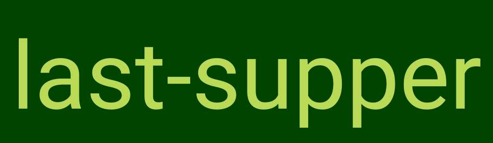

# last-supper
> A dummy image service written in Go.

This is basically a rewrite of [imgsrc](https://github.com/mabels/ImgSrc)
with the only difference that it is written in Go and therefore doesn't
require the JVM.

Note that `last-supper` isn't a drop-in replacement for `imgsrc` because
it isn't fully API compatible.

## Install
Download the pre-built binary for your platform from the
[*releases*](https://github.com/Fahrradflucht/last-supper/releases) tab.
If you want you can put it somewhere in your `PATH`.

### Building from source
If you have Go installed on your machine you can also just run
```bash
go get github.com/Fahrradflucht/last-supper
```
Assuming you `GOPATH` is in your `PATH` you should now be able to just
execute `last-supper`.

## Usage
```
$ last-supper --help
Usage of last-supper:
  -port int
    	Port on which to run the server. (default 8080)
  -font string
    	Path to a ttf file to be used as image font
```

Without any addtional configuration `last-supper` will listen on port 8080
for requests with the following schema:
`http://localhost:8080/{width}x{height}/{bg-color}/{text-color}/{text}.{format}`

Where:
 - `width` is an integer between 0 and 5000
 - `height` is an integer between 0 and 5000
 - `bg-color` is a hex color code (3 or 6 digits)
 - `fg-color` is a hex color code (3 or 6 digits)
 - `text` is a string to be rendered to the image
 - `format` is a one of:
   - .png to get a PNG
   - .bmp to get a BMP
   - .jpg or .jpeg to get a JPEG
   - .gif to get a GIF *(Note: Gif generation is very slow for large
     images)*

So this request for example:
```
http://localhost:8080/1024x300/040/bada55/last-supper.jpeg
```
Would return this image:


## License
[MIT © Mathis Wiehl](../LICENSE)
